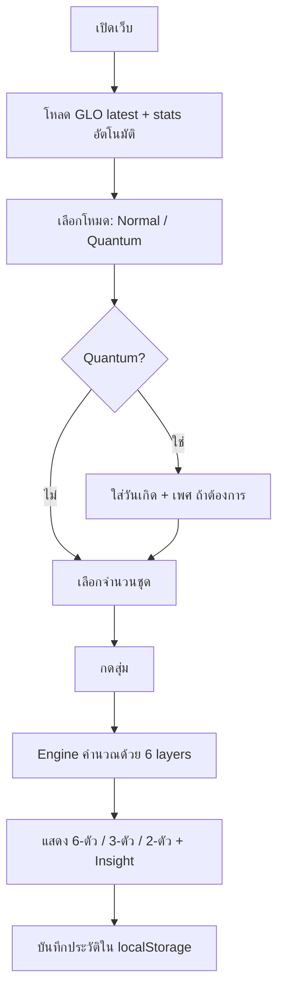

# Yor Lotto — Product Specification

## ภาพรวม

Yor Lotto เป็น Web App สำหรับสุ่มเลขนำโชคแนวสลากกินแบ่งรัฐบาลไทย ออกแบบให้ผู้ใช้กดสุ่มครั้งเดียวแล้วได้เลขครบ 3 รูปแบบ พร้อมข้อมูลสถิติจริงจาก GLO

## สถานะปัจจุบัน

| Phase | สถานะ |
|---|---|
| Phase 1 — MVP (สุ่มเลข, ประวัติ localStorage) | ✅ เสร็จแล้ว |
| Phase 2 — GLO API, สถิติ, Quantum Mode | ✅ เสร็จแล้ว |
| Phase 3 — Firebase, Login, Cross-device | 🔲 ยังไม่ได้ทำ |

---

## Phase 2 — ฟีเจอร์ที่มีอยู่

### โหมดสุ่ม

| โหมด | ชื่อใน UI | คำอธิบาย |
|---|---|---|
| `pure` | Normal | สุ่มแบบ Math.random() ล้วน |
| `smart` | ✦ Quantum | ถ่วงน้ำหนักด้วย GLO stats + ประวัติ + วันเกิด + เพศ |

### Quantum Mode — Algorithm Layers

เลข 2-ตัวและ 3-ตัวสุ่มจาก weighted pool; เลข 6-ตัวใช้ per-position weights

```
final_weight = GLO_stat_weight
             × birthday_bonus        (ถ้าใส่วันเกิด)
             × gender_alignment      (ถ้าเลือกเพศ)
             × position_amplifier    (ตามตำแหน่ง Yang/Yin)
             × history_penalty       (digit ที่ใช้บ่อยเกิน)
             × anti_repeat           (2/3-ตัวที่เพิ่งออก)
```

#### วันเกิด (ไม่บังคับ)
- Digit ที่ตรงกับวันเกิด ค.ศ. ได้ × 1.6

#### เพศ (ไม่บังคับ) — หลักเลขศาสตร์ไทย Yin/Yang
- **ชาย (Yang/ธาตุไฟ-ไม้)**: เลขคี่ (1,3,5,7,9) × 1.5 | เลขคู่ × 0.7
  ตำแหน่ง Yang ของเลข 6 ตัว (pos 0,2,4) → amplify × 1.4
- **หญิง (Yin/ธาตุน้ำ-โลหะ)**: เลขคู่ (0,2,4,6,8) × 1.5 | เลขคี่ × 0.7
  ตำแหน่ง Yin ของเลข 6 ตัว (pos 1,3,5) → amplify × 1.4

#### History Penalty
- Digit ที่ปรากฏเกิน 15% ใน 15 รายการล่าสุด → น้ำหนักลดเหลือ 30%

#### Anti-repeat
- 2-ตัว/3-ตัวที่เพิ่งออกใน 10 รายการล่าสุด → น้ำหนักลดเหลือ 5%

### ผลรางวัลงวดล่าสุด
- ดึงจาก GLO API โดยตรงผ่าน `/api/glo/latest`
- แสดง: รางวัลที่ 1, 3 ตัวหน้า, 3 ตัวท้าย, 2 ตัวท้าย

### สถิติเลขร้อน / เลขเย็น
- ดึงจาก `getMissionStatsRewardPrevious`
- เลือก period ได้: 6/12/24 งวด (default 12)
- แสดง top-10 hot / bottom-10 cold ทั้ง 2-ตัวและ 3-ตัวท้าย พร้อม bar chart

### Insight หลังสุ่ม
- ทุก result card แสดงข้อความอธิบายว่าเลขที่ได้ร้อน/เย็น/ปกติแค่ไหน
- เปรียบเทียบกับสถิติ GLO ที่โหลดอยู่

### Debug Tool
- ปุ่ม "ทดสอบ Connection GLO" ใน control panel
- Probe ทุก endpoint พร้อม HTTP status, latency (ms), และ response preview

---

## Technology Stack

| ส่วน | เทคโนโลยี |
|---|---|
| Framework | Next.js 16 (App Router) |
| Language | TypeScript |
| Styling | CSS (globals.css เท่านั้น — ไม่มี Tailwind) |
| State | React useState / useEffect |
| Storage | Browser localStorage |
| Data Source | GLO Public API |
| Font | IBM Plex Sans Thai + Material Symbols Outlined |
| Deploy | Vercel |

## โครงสร้างไฟล์

```
app/
  page.tsx              หน้าหลัก (UI + state ทั้งหมด)
  layout.tsx            Layout, meta, fonts
  globals.css           Styles ทั้งหมด
  api/glo/
    latest/route.ts     Proxy ผลรางวัลล่าสุด
    stats/route.ts      Proxy สถิติความถี่
    debug/route.ts      Debug probe

lib/
  lotto-engine.ts       Algorithm สุ่มเลข
  stats-engine.ts       computeStats + getInsight
  glo-types.ts          TypeScript types
  date-utils.ts         Countdown helper
```

## Data Privacy

- วันเกิดและเพศไม่ถูกส่งออก server — ใช้ client-side เท่านั้น
- ประวัติสุ่มเก็บใน `localStorage` ของ browser เท่านั้น
- ไม่มี database, ไม่มี analytics, ไม่มี login

## Flow การใช้งาน



---

## แผน Phase 3

### Firebase Integration
- **Firestore**: cache ผล GLO, เก็บประวัติแบบ anonymous
- **Firebase Auth**: optional login เพื่อ sync ประวัติข้ามเครื่อง
- **Firebase Analytics**: track event กดสุ่ม, โหมดที่ใช้, จำนวนชุด

### API Routes เพิ่มเติม
```
GET  /api/glo/periods          รายการงวดย้อนหลัง
POST /api/glo/by-date          ผลรางวัลตามวันที่ (ถ้า GLO เปิด endpoint)
```

### Dashboard สถิติเพิ่มเติม
- เลขร้อน/เย็นแบบ interactive chart
- เลือกช่วงวันที่แบบ custom
- เปรียบเทียบสถิติระหว่าง period

## หมายเหตุ

เว็บนี้ทำขึ้นเพื่อความบันเทิงเท่านั้น ไม่สามารถทำนายผลสลากได้จริง การสุ่มทุกรูปแบบใช้ `Math.random()` เป็นพื้นฐาน สถิติและน้ำหนักเป็นเพียงตัวแปรประกอบการตัดสินใจ ไม่ใช่การพยากรณ์
