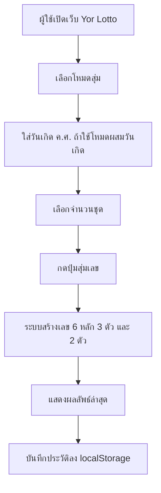
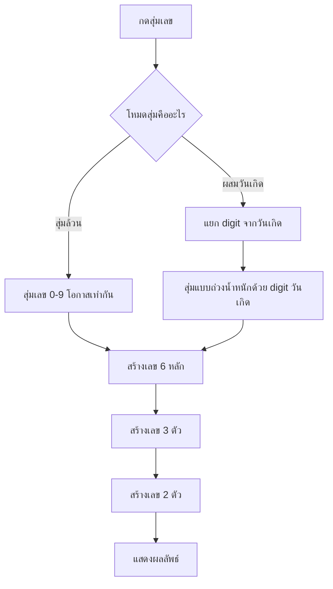

# Yor Lotto - หลักการทำงานและฟีเจอร์ของเว็บ

## ภาพรวม

Yor Lotto เป็น Web App สำหรับสุ่มเลขแนวสลากกินแบ่ง โดยออกแบบให้ผู้ใช้กดสุ่มครั้งเดียวแล้วได้เลขครบ 3 รูปแบบ:

- เลข 6 หลัก
- เลข 3 ตัว
- เลข 2 ตัว

ใน Phase 1 ระบบทำงานบนหน้าเว็บเป็นหลัก ยังไม่ต้อง login และยังไม่เก็บข้อมูลผู้ใช้บน server ประวัติการสุ่มจะถูกเก็บไว้ใน browser ของผู้ใช้ผ่าน `localStorage`

## เป้าหมายของ Phase 1

Phase 1 เน้นทำให้เว็บใช้งานได้จริงก่อน โดยมีเป้าหมายหลักคือ:

- สุ่มเลขได้ทันที
- รองรับการสุ่มหลายชุด
- มีโหมดสุ่มล้วน
- มีโหมดผสมเลขจากวันเกิด ค.ศ.
- แสดงผลลัพธ์ชัดเจน
- เก็บประวัติการสุ่มล่าสุดในเครื่องผู้ใช้
- พร้อม deploy บน Vercel ผ่าน GitHub

## Technology ที่ใช้

ระบบ Phase 1 ใช้เทคโนโลยีดังนี้:

- Next.js
- React
- TypeScript
- CSS ปกติผ่าน `app/globals.css`
- Browser `localStorage` สำหรับเก็บประวัติ

เหตุผลที่เลือก Next.js:

- deploy ขึ้น Vercel ได้ง่าย
- รองรับการต่อ API Routes ใน Phase ถัดไป
- เหมาะกับเว็บที่ต้องการทั้งหน้าเว็บและ backend เบา ๆ ในโปรเจกต์เดียว

## โครงสร้างไฟล์หลัก

```text
app/
  layout.tsx       โครง layout หลักของเว็บ
  page.tsx         หน้าแรกและ logic การสุ่มเลข
  globals.css      style ทั้งหมดของหน้าเว็บ

package.json       dependency และ script สำหรับ dev/build
README.md          วิธี run และ deploy เบื้องต้น
YOR_LOTTO_SPEC.md  เอกสารอธิบายระบบ
```

## หน้าเว็บหลัก

หน้าแรกของ Yor Lotto ประกอบด้วยส่วนหลัก:

1. ส่วนแนะนำเว็บ
2. ช่องใส่วันเกิด ค.ศ.
3. ตัวเลือกโหมดสุ่ม
4. ตัวเลือกจำนวนชุด
5. ปุ่มสุ่มเลข
6. กล่องแสดงผลลัพธ์ล่าสุด
7. ประวัติการสุ่มล่าสุด

## ฟังก์ชั่นปัจจุบัน

### 1. สุ่มเลข 6 หลัก

ระบบสร้างเลข 6 หลักจากตัวเลข `0-9`

ตัวอย่าง:

```text
482913
```

เลขสามารถขึ้นต้นด้วย `0` ได้ เช่น:

```text
007421
```

### 2. สุ่มเลข 3 ตัว

ระบบสร้างเลข 3 ตัวจากตัวเลข `0-9`

ตัวอย่าง:

```text
729
```

เลขสามารถขึ้นต้นด้วย `0` ได้ เช่น:

```text
034
```

### 3. สุ่มเลข 2 ตัว

ระบบสร้างเลข 2 ตัวจากตัวเลข `0-9`

ตัวอย่าง:

```text
45
```

เลขสามารถขึ้นต้นด้วย `0` ได้ เช่น:

```text
08
```

### 4. สุ่มหลายชุด

ผู้ใช้เลือกจำนวนชุดได้:

- 1 ชุด
- 5 ชุด
- 10 ชุด

หนึ่งชุดประกอบด้วย:

```text
เลข 6 หลัก + เลข 3 ตัว + เลข 2 ตัว
```

### 5. โหมดสุ่มล้วน

โหมด `สุ่มล้วน` ใช้การสุ่มแบบโอกาสเท่ากันทุกเลข

หลักการ:

```text
เลข 0-9 มีโอกาสถูกเลือกเท่ากัน
```

เหมาะกับผู้ใช้ที่อยากได้เลขแบบ random ตรง ๆ โดยไม่เอาข้อมูลอื่นมาผสม

### 6. โหมดผสมวันเกิด

โหมด `ผสมวันเกิด` ให้ผู้ใช้ใส่วันเกิดแบบ ค.ศ. เช่น:

```text
1994-08-21
```

ระบบจะแปลงเป็นเลขตั้งต้น:

```text
19940821
```

แล้วแยกเป็น digit:

```text
1, 9, 9, 4, 0, 8, 2, 1
```

จากนั้นระบบจะใช้เลขเหล่านี้ช่วยถ่วงน้ำหนักในการสุ่ม ทำให้เลขจากวันเกิดมีโอกาสปรากฏมากกว่าสุ่มล้วน แต่ผลลัพธ์ยังคงมีความสุ่มอยู่

### 7. Insight หลังสุ่ม

ในแต่ละชุด ระบบจะแสดงข้อความสั้น ๆ เพื่อบอกที่มาของผลลัพธ์ เช่น:

```text
สุ่มจากเลข 0-9 โอกาสเท่ากัน
```

หรือในโหมดผสมวันเกิด:

```text
ตรงกับเลขวันเกิด 5 ตำแหน่ง
```

### 8. คัดลอกผลลัพธ์

แต่ละชุดมีปุ่ม `คัดลอก`

เมื่อกด ระบบจะ copy ข้อความรูปแบบนี้ไปยัง clipboard:

```text
Yor Lotto: 6 หลัก 482913, 3 ตัว 729, 2 ตัว 45
```

### 9. ประวัติการสุ่ม

ระบบเก็บประวัติการสุ่มล่าสุดไว้ใน browser ของผู้ใช้

ข้อมูลที่เก็บ:

- เวลา
- เลข 6 หลัก
- เลข 3 ตัว
- เลข 2 ตัว
- โหมดสุ่ม

ระบบเก็บไว้สูงสุด 20 รายการ แต่หน้าเว็บแสดงล่าสุด 8 รายการ

## หลักการทำงานของ Random Engine

### ฟังก์ชั่นสุ่มเลขพื้นฐาน

ระบบมีฟังก์ชั่นสุ่มเลข 1 หลัก:

```text
randomDigit()
```

หน้าที่:

```text
สุ่มเลข 0-9 แล้วคืนค่าเป็น string
```

### ฟังก์ชั่นสร้างเลขตามความยาว

ระบบใช้ฟังก์ชั่น:

```text
makeNumber(length, seedDigits, mode)
```

ตัวอย่าง:

```text
makeNumber(6, [], "pure")
```

จะได้เลข 6 หลักแบบสุ่มล้วน

```text
makeNumber(3, ["1", "9", "9", "4"], "birthday")
```

จะได้เลข 3 ตัวแบบผสมเลขจากวันเกิด

### การถ่วงน้ำหนักด้วยวันเกิด

ในโหมดผสมวันเกิด ระบบใช้ logic ประมาณนี้:

```text
ถ้ามีเลขวันเกิด และเข้าเงื่อนไขถ่วงน้ำหนัก
  เลือกเลขจากชุดเลขวันเกิด
ไม่เช่นนั้น
  สุ่มเลข 0-9 ตามปกติ
```

แนวคิดคือให้ผลลัพธ์ยังไม่ล็อกตายตัว แต่มีแนวโน้มเชื่อมโยงกับวันเกิดของผู้ใช้

## Data Privacy

Phase 1 ไม่ส่งวันเกิดไป server

ข้อมูลวันเกิดถูกใช้ในหน้าเว็บเพื่อช่วยสุ่มเท่านั้น และไม่ได้ถูกบันทึกลงฐานข้อมูล

ประวัติการสุ่มถูกเก็บใน `localStorage` ของ browser ผู้ใช้เท่านั้น ไม่ได้ส่งออกไปที่อื่น

## ข้อความด้านความรับผิดชอบ

เว็บควรสื่อสารชัดเจนว่า:

```text
ใช้การสุ่มเพื่อความบันเทิงเท่านั้น
```

ไม่ควรสื่อว่าเว็บสามารถทำนายผลสลากได้จริง

## Flow การใช้งาน



## Flow การสุ่มเลข



## สิ่งที่ยังไม่ได้ทำใน Phase 1

Phase 1 ยังไม่รวม:

- เชื่อม API ของ GLO
- ดึงผลรางวัลงวดล่าสุด
- ดูสถิติย้อนหลังจริง
- เชื่อม Firebase
- ระบบ login
- เก็บประวัติข้ามเครื่อง
- dashboard สถิติเลขร้อน/เลขเย็น

## แผนต่อยอด Phase 2

Phase 2 ควรเพิ่ม:

### 1. เชื่อม GLO API

API ที่ควรใช้:

```text
POST https://www.glo.or.th/api/lottery/getLatestLottery
POST https://www.glo.or.th/api/checking/getLotteryResult
POST https://www.glo.or.th/api/lottery/getPeriodList
POST https://www.glo.or.th/api/mission/getMissionStatsRewardPrevious
```

### 2. เพิ่ม API Routes ของ Yor Lotto

ตัวอย่าง route:

```text
GET  /api/glo/latest
POST /api/glo/by-date
POST /api/glo/stats
GET  /api/glo/periods
POST /api/random/generate
```

### 3. เพิ่มสถิติย้อนหลัง

ฟีเจอร์ที่ควรมี:

- เลขท้าย 2 ตัวที่ออกบ่อย
- เลขท้าย 2 ตัวที่ไม่ค่อยออก
- เลขหน้า 3 ตัว
- เลขท้าย 3 ตัว
- เลือกช่วงวันที่
- จัดอันดับเลขร้อน/เลขเย็น

### 4. เพิ่ม Insight จากสถิติ

ตัวอย่าง:

```text
เลขท้าย 45 ออกมาแล้ว 3 ครั้งในช่วงที่เลือก
```

```text
เลข 729 ยังไม่เคยออกในช่วงย้อนหลังนี้
```

## แผนต่อยอด Phase 3

Phase 3 ควรเพิ่ม Firebase:

### Firestore

ใช้เก็บ:

- cache ผลรางวัลจาก GLO
- cache สถิติย้อนหลัง
- ประวัติการสุ่มแบบไม่ระบุตัวตน
- app settings

### Firebase Analytics

ใช้ดู:

- จำนวนผู้ใช้งาน
- จำนวนครั้งที่กดสุ่ม
- โหมดสุ่มที่นิยม
- จำนวนชุดที่นิยม

### Firebase Auth

ยังไม่จำเป็นในช่วงแรก แต่ถ้าต้องการให้ผู้ใช้มีบัญชี สามารถเพิ่มภายหลังได้

## แนวทาง Deploy

ระบบเหมาะกับ workflow:

```text
เขียนโค้ดในเครื่อง
push ขึ้น GitHub
เชื่อม GitHub กับ Vercel
Vercel deploy อัตโนมัติ
```

คำสั่งสำหรับ run local:

```bash
npm install
npm run dev
```

คำสั่งตรวจ build:

```bash
npm run build
```

## สรุป

Yor Lotto Phase 1 เป็น Web App สำหรับสุ่มเลขที่ใช้งานได้จริงแล้วในระดับ MVP โดยมีจุดเด่นคือการสุ่มครบ 6 หลัก 3 ตัว และ 2 ตัวในครั้งเดียว พร้อมโหมดผสมวันเกิด ค.ศ.

ระบบถูกออกแบบให้ต่อยอดง่ายใน Phase ถัดไป โดยสามารถเพิ่ม GLO API, Firebase, ระบบ cache และสถิติย้อนหลังได้โดยไม่ต้องรื้อโครงสร้างหลักใหม่
